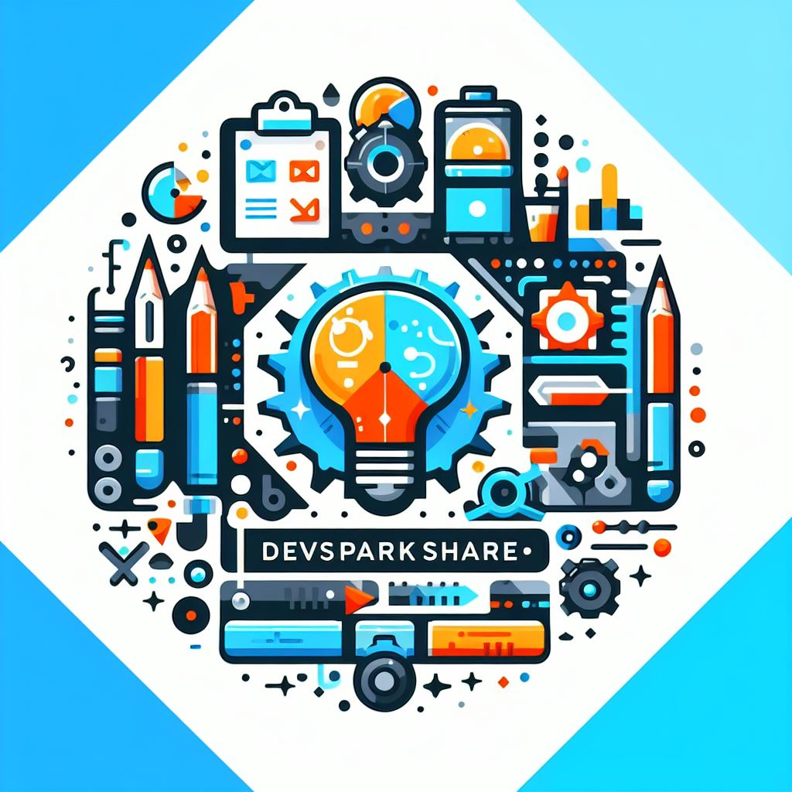

# DevSparkShare

[](LICENSE)
[](CONTRIBUTING.md)
[](https://travis-ci.org/your-username/DevSparkShare)
[](https://coveralls.io/github/your-username/DevSparkShare?branch=main)
[](https://david-dm.org/your-username/DevSparkShare)

<div style="display: flex; width: 100%; justify-content: center;">
  
</div>

## Overview 🚀

DevSparkShare is a collaborative platform for developers to share outstanding prompts, solve real-world issues, and earn tokens for impactful contributions. Built with Next.js and powered by web3 technology.

## Features 🔥

- **Collaboration:** Foster a community-driven space for developers to collaborate on problem-solving.
- **Token Rewards:** Earn tokens for sharing outstanding prompts and contributing to the platform.
- **Next.js:** Utilizes the power of Next.js for a modern and efficient web development experience.
- **Web3 Integration:** Harness the capabilities of web3 technology for secure and decentralized interactions.

## Getting Started 🛠️

1. **Clone the Repository:**

    ```bash
    git clone https://github.com/your-username/DevSparkShare.git
    cd DevSparkShare
    ```

2. **Install Dependencies:**

    ```bash
    npm install
    ```

3. **Run Locally:**

    ```bash
    npm run dev
    ```

    Visit [http://localhost:3000](http://localhost:3000) in your browser.

## How to Use 📖

1. **Sign Up:**
   - Create an account on DevSparkShare to start sharing and collaborating.

2. **Share Prompts:**
   - Post outstanding prompts that help solve real-world development issues.

3. **Earn Tokens:**
   - Receive tokens based on the impact and popularity of your shared prompts.

4. **Contribute:**
   - Collaborate with other developers by providing valuable insights and solutions.

## Contributing 🤝

We welcome contributions! Please check out our [Contribution Guidelines](CONTRIBUTING.md) for details.

## License 📝

This project is licensed under the [MIT License](LICENSE).

---

**Note:** Replace `your-username` and `path/to/your/logo.png` with your actual GitHub username and the path to your project logo.
